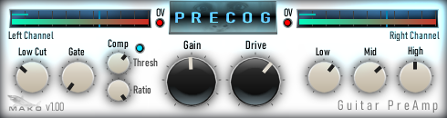

# MakoPrecog
* A demo JUCE VST guitar preamplifier and conditioner
* Sample code.
* Tested on Windows only.
* Written in Visual C++ 2022.
* Written for new programmers, not complicated.
* Version: 1.00
* Posted: July 10, 2024

VERSION
------------------------------------------------------------------
1.00 - Initial release.  

DISCLAIMER
------------------------------------------------------------------  
This VST was written in a very simple way. No object defs, etc. 
Just simple code for people who are not programmers but want to 
dabble in the magic of JUCE VSTs.

If you are new to JUCE code, the Mako Thump VST may be a better
starting place. Or be brave and try this.
       
SUMMARY
------------------------------------------------------------------
A Juce/C++ VST3 written to allow users to finetune a guitar signal
for use with other amplifier VSTs.

# THEORY OF OPERATION 
This VST is designed to accompany and enhance other amplifier VSTs.

The guitar signal chain thru the VST is:  
Guitar -> Low Cut -> Noise Gate -> EQ -> Gain -> Compressor

There are many new amplifier VSTs out that rely on user created amplfier profiling. These VSTs can be limited to the fixed state of the user created profile.
To help make all profiles more useful, this VST adds some guitar preamplifier conditioning features.

LOW CUT  
This VST will let the user reduce the lows entering the next VST. This helps clean up and reduce boominess.
The guitar input signal can be reduced from 30 Hz to 200 Hz.

A setting of 20 Hz (Lowest) turns off the filter to reduce CPU usage.

3 BAND EQ  
A simple EQ is added to enhance certain frequencies entering an amplifier.
* 450 Hz - Thickens the guitar tone.
* 750 Hz - Typical frequency pushed by gain pedals.
* 1500 Hz - Used to add some more brightness and presence.

NOTE: Since our EQ circuit adds volume, it can be used to boost distortion.

COMPRESSOR  
A simple Compressor was added to enhance pick attack. This has a fixed attack time of 5 mS. It has two normal compressor adjustments:
* Threshold - Sets the signal level where the compressor should kick in.
* Ratio - How much volume reduction to apply when the threshold is crossed.

A setting of 1.0 (Full On) means the compressor is OFF and not being used.  

The compressor threshold is drawn on the metering area and an LED will light when the threshold is passed.

SIGNAL LEVEL METERING  
An important aspect of VSTs is getting the guitar signal to an expected level. 
* If the signal is too low entering a VST, the sound may be thin.
* Too much signal can create clipping distortion.

It is important to get the signal as loud as possible without any clipping. This will give the best possible quality when the analog signal is converted to digital.
On the flip side, certain VST profiles may sound better with reduce input volume. Adjust as needed.

This VST has Input/Output meters to ease the process of maximizing the signal levels. It also has an OVERLOAD/CLIPPING LED for output signals only.

NOTE: The compressor will let the initial pick attacks thru, but will reduce overall volume. 
and brittle sounding. 

DRIVE  
This VST also adds some slight distortion that may help even out the guitar volume or makes things seem more present. 

When the drive is pushed high, the VST will act as an OD pedal. The EQ section will then really help to dial in the sound. 

VST REALTIME DISPLAY OF SIGNAL  
The VST uses a timer set to a 10 Hz refresh. This means the TIMER callback code will be called 10 times per second. This should be fine for signal monitoring.
The higher the setting, the more often the screen will be redrawn which wastes precious CPU cycles. It is imperitive to reduce CPU usage as much as possible.

To reduce the CPU usage during redraws, a fixed background image is used. All UI elements, knobs, etc that do not need to be animated are in the single background image.
During redraws only the signal level bars, compressor threshold lines, and KNOB pointers are draw in real time.

The code in the TIMER tries to track signal level changes and will only call a UI redraw when it is necessary. To do this it converts the signal level to an integer between
0 and 100 and compares current to last drawn values. A detected difference triggers a redraw.

Code is included to give a basic drawing of the VST without the use of the background image. This is useful to get positions of the UI elements to make your own background image.
Flags in the PAINT and SLIDER need to be set to change from bitmap image to normal drawing mode.

